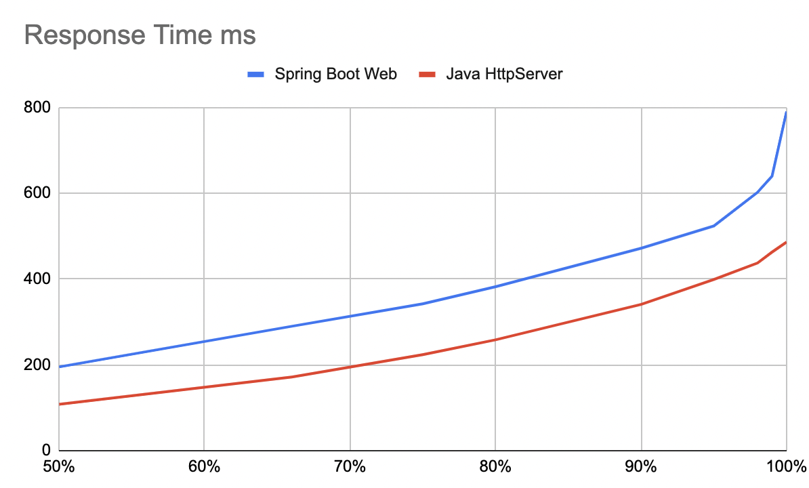
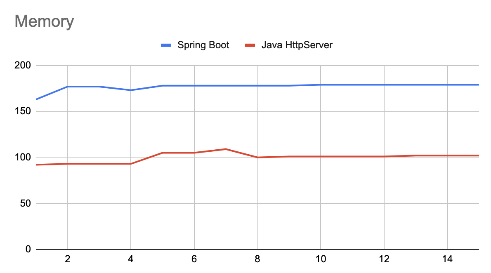
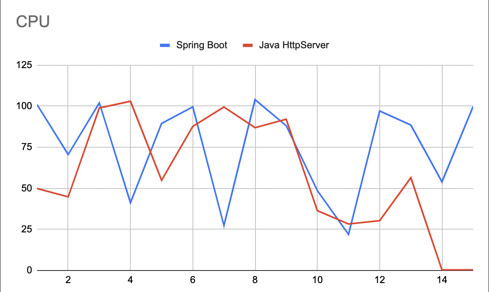

# Compile and Docker image

**Java HttpServer project Compile and package**

Java HttpServer project is an IntelliJ project, build and create a Jar artifact.

You can build a Docker image for this project with the following command.
```
docker build -t http-app:0.0.1 .

docker run --rm -it --memory="256MB" --cpus="1.0" -p 8080:8080 --name http-app http-app:0.0.1
```


**Spring Boot project Compile and package**
Spring Boot Web project is a Spring Boot project, you can build and create an artifact with maven.


You can build a Docker image for this project with the following command.
```
docker build -t demo-app:0.0.1 .
```

# Run Projects

Run the `jwebserver` in the root folder with the following command. Both of the apps use this endpoint.
```
jwebserver -p 7070 -b 0.0.0.0 -o none
```

You can run the Spring Boot Application with the following command.
```
docker run --rm -it --memory="256MB" --cpus="1.0" -p 8080:8080 --name demo-app demo-app:0.0.1
```

You can run the Spring Boot Application with the following command.
```
docker run --rm -it --memory="256MB" --cpus="1.0" -p 8080:8080 --name demo-app demo-app:0.0.1
```

# Run the test

You can create the load with the following command.
```
for i in {1..10}; do ab -n 1000 -c 100 http://localhost:8080/ ; sleep 1; done
```

You can get the CPU and Memory usages of the containers with the following command.
```
# Java HttpServer
for i in {1..100}; do docker stats --no-stream | grep http-app ; done

# Spring Boot 
for i in {1..100}; do docker stats --no-stream | grep demo-app ; done
```


# Test results








